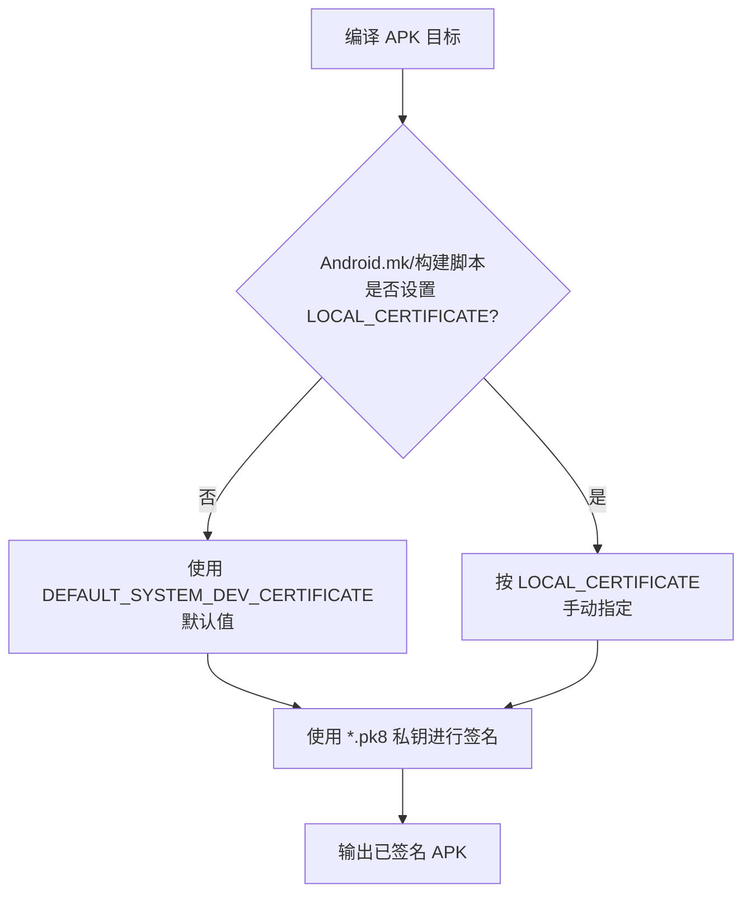

+++
title = 'Android 系统 Build 阶段 APK 签名机制（通俗笔记）'
date = '2026-06-08T16:36:00+08:00'
draft = false
+++

# Android 系统 Build 阶段 APK 签名机制（通俗笔记）

> 面向：刚接触 AOSP/系统应用开发、需要“系统签名 / system 权限”概念的人  
> 目标：用更直白的方式理解 **AOSP 在编译（build）时如何给 APK 签名**，以及 **如何自定义签名 key**、**如何让 APK 以 system UID 运行**。

原文参考：<https://maoao530.github.io/2017/01/31/android-build-sign/>

---

## 0. 你需要先知道的 3 个概念

1. **签名是干什么的？**  
   Android 用签名来确认“这个 APK 是谁发布/构建的”，并据此决定：
   - 是否允许共享 UID（sharedUserId）
   - 是否允许同签名应用间共享数据/权限
   - 系统应用/特权能力是否能被授予（取决于场景与版本策略）

2. **非对称加密（公钥/私钥）一句话版**  
   - **私钥**：必须保密，用来“签名”。  
   - **公钥**：可以公开，用来“验签”。  

3. **Build 阶段签名 ≠ Android Studio 打包签名**  
   - 这里讲的是 **AOSP 源码编译**（make/soong）时，系统在构建流程中对 APK 进行签名。  
   - Android Studio 的 keystore/gradle 签名属于另一条链路，但原理相通。

---

## 1. AOSP 默认有哪些签名 Key？

系统源码里默认准备了 **4 组 key**，用于在 build 阶段给不同类型的 APK 签名。它们默认位于：

`build/target/product/security/`

每组 key 都有两类文件：

- `*.pk8`：**私钥**（用于签名）
- `*.x509.pem`：**公钥证书**（用于验签）

| key 名称 | 私钥文件     | 公钥文件          | 常见用途（通俗理解）                       |
| -------- | ------------ | ----------------- | ------------------------------------------ |
| testkey  | testkey.pk8  | testkey.x509.pem  | 默认普通 APK（不指定时用它）               |
| platform | platform.pk8 | platform.x509.pem | 系统核心/平台相关 APK（常用于 system UID） |
| shared   | shared.pk8   | shared.x509.pem   | 与共享 UID / 共享权限相关的一类系统组件    |
| media    | media.pk8    | media.x509.pem    | media/download 等相关组件                  |

> 记忆方法：  
> **testkey = 默认**；**platform = 系统平台核心**；shared/media 是系统特定组件链路会用到的 key。

---

## 2. Build 时到底用哪把 key 给 APK 签名？

### 2.1 由 Android.mk 的 `LOCAL_CERTIFICATE` 决定

在 APK 的 `Android.mk`（或对应构建脚本）里，通过 `LOCAL_CERTIFICATE` 指定签名类型：

```make
LOCAL_CERTIFICATE := testkey   # 普通 APK（默认）
LOCAL_CERTIFICATE := platform  # 系统核心能力相关（常见：system UID）
LOCAL_CERTIFICATE := shared    # 系统链路组件
LOCAL_CERTIFICATE := media     # 系统链路组件
```

**如果你不写 `LOCAL_CERTIFICATE`，默认会使用 testkey。**

### 2.2 默认签名 key 的兜底逻辑（config.mk）

`build/core/config.mk` 中有默认值（原文核心片段如下）：

```make
# The default key if not set as LOCAL_CERTIFICATE
ifdef PRODUCT_DEFAULT_DEV_CERTIFICATE
  DEFAULT_SYSTEM_DEV_CERTIFICATE := $(PRODUCT_DEFAULT_DEV_CERTIFICATE)
else
  DEFAULT_SYSTEM_DEV_CERTIFICATE := build/target/product/security/testkey
endif
```

含义（通俗翻译）：

- 厂商如果在产品配置里设置了 `PRODUCT_DEFAULT_DEV_CERTIFICATE`，那就用厂商指定的默认 key 路径；
- 否则就用 AOSP 自带的 `testkey`。

---

## 3. 为什么“系统签名”常常还要配 `sharedUserId`？

很多同学的目标其实是：**让 APK 具备 system 权限/以 system UID 运行**。  
在传统 AOSP 体系里，一个常见组合是：

1) `AndroidManifest.xml` 中声明：

```xml
<manifest
    ...
    android:sharedUserId="android.uid.system">
```

2) `Android.mk` 中使用 platform key：

```make
LOCAL_CERTIFICATE := platform
```

这样重新编译后，应用进程的 UID 可能会变成 system（可用 `ps` 等方式查看）。

> 注意：不同 Android 版本、不同 ROM/安全策略（SELinux、privapp-permissions、签名白名单等）会影响“是否真能拿到你想要的能力”。  
> 但从本文的 build 签名角度，核心就是：**manifest 的 sharedUserId + 匹配的签名**。

---

## 4. Build 阶段签名流程（图解）

下面用一个“编译→选择 key→签名→产物”的简化流程图帮助理解：



---

## 5. 如何自定义系统签名 key（releasekey 等）

> 目的：不用 AOSP 默认 key，而是生成“你们自己的”平台 key（更符合量产/安全要求）。

原文给出的做法是使用 `Development/tools/` 下的 `make_key` 工具生成 key。

### 5.1 进入工具目录


### 5.2 使用 make_key 生成一组 key

示例（生成名为 `releasekey` 的一组 key）：

```bash
sh make_key releasekey '/C=CN/ST=Guangdong/L=Shenzhen/O=Mediatek/OU=MTK/CN=fzll/emailAddress=maoao530@foxmail.com'
```

参数解释（证书 DN 信息）：

- C：国家（2 位代码）
- ST：省/州
- L：城市
- O：组织/公司
- OU：部门
- CN：通用名（人名/服务器名）
- emailAddress：邮箱

### 5.3 生成结果是什么？

你会看到多出两个文件：

- `releasekey.x509.pem`
- `releasekey.pk8`

（原文截图）


### 5.4 生成 platform/shared/media 等其它 key

同样步骤分别生成 `platform` / `shared` / `media` 对应的 key（做法与上面一致）。

### 5.5 替换系统默认 key

将你自定义生成的 key **替换** 到：

`build/target/product/security/`

之后再次编译，系统 build 阶段就会使用你替换后的 key 来签名产物。

---

## 6. 如何对 APK 进行“系统签名”（通俗步骤）

如果你的目标是“让 APK 具备 system 相关能力”，常见步骤（对应原文第 3 节）：

1. 在 `AndroidManifest.xml` 的 `<manifest>` 上加：

```xml
android:sharedUserId="android.uid.system"
```

2. 在 `Android.mk` 中加：

```make
LOCAL_CERTIFICATE := platform
```

3. 重新编译（产物为已签名 APK），并通过进程 UID 观察效果（例如 `ps`）。

---

## 7. 常见坑与注意事项（强烈建议读）

1. **私钥（.pk8）一定要保密**  
   一旦泄露，别人就能伪造“同签名 APK”，后果严重。

2. **不要在量产设备继续用 AOSP 默认 testkey/platform**  
   这些 key 是公开的，安全性极差。量产必须替换为厂商自有 key。

3. **`sharedUserId` 在新版本 Android 中限制更多**  
   Android 逐步收紧 sharedUserId 的使用，升级系统时需要额外评估兼容性与策略要求。

4. **“系统签名”不等于自动拥有所有特权**  
   还可能需要配套：
   - 作为 /system/priv-app 安装
   - privapp-permissions 白名单
   - SELinux domain / sepolicy 配置等

---

## 8. 一句话总结

- AOSP build 阶段会根据 `LOCAL_CERTIFICATE`（或默认值）选择 key，在编译过程中对 APK 进行签名。  
- 系统默认提供 testkey/platform/shared/media 四组 key；厂商量产应生成并替换自有 key。  
- 想让 APK 以 system UID 运行，常见组合是：`sharedUserId=android.uid.system` + `LOCAL_CERTIFICATE := platform`（并配合系统策略）。

