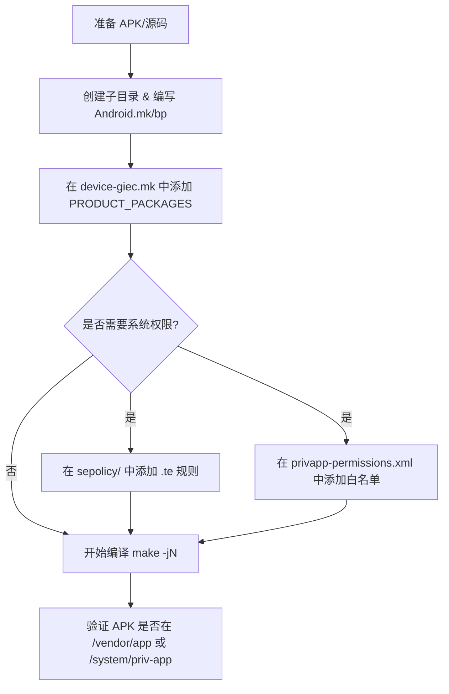

+++
title = '预置APK'
date = '2026-06-08T16:37:00+08:00'
draft = false
+++

### **1. 目录结构扫描与功能说明**

| 一级目录      | 二级目录 (关键)    | 作用说明                                      | APP 相关标注            |
| :------------ | :----------------- | :-------------------------------------------- | :---------------------- |
| **amlogic/**  | `common/apps/`     | Amlogic 通用第三方或预置 APP (如 Netflix)     | **APP 源码/APK 存放地** |
|               | `reference/apps/`  | Amlogic 参考应用 (如 TVInput, DLNA)           | **APP 源码存放地**      |
|               | `common/sepolicy/` | Amlogic 通用 SELinux 策略                     | 权限配置                |
| **giec/**     | `apps/`            | GIEC 厂商自定义 APP (如 Glauncher, OTAClient) | **核心 APP 存放地**     |
|               | `common/sepolicy/` | GIEC 厂商自定义 SELinux 策略                  | 权限配置                |
|               | `android-certs/`   | 厂商签名密钥 (platform, shared 等)            | **签名资源**            |
|               | `executable/`      | 厂商自定义脚本与二进制工具                    | 运行辅助                |
| **widevine/** | `libwvdrmengine/`  | Widevine DRM 相关组件                         | 辅助组件                |

---

### **2. 构建文件 (Android.mk/Android.bp) 分析**

#### **(1) 预置 APK 模式 (以 Glauncher 为例)**
在 [Glauncher/Android.mk](file:///z:/android/aml/s905x5/aml-s905x5-androidu-v2/vendor/giec/apps/Glauncher/Android.mk) 中：
```makefile
LOCAL_PATH := $(call my-dir)
include $(CLEAR_VARS)
LOCAL_MODULE := Glauncher
LOCAL_SRC_FILES := Glauncher.apk
LOCAL_MODULE_CLASS := APPS
LOCAL_MODULE_SUFFIX := $(COMMON_ANDROID_PACKAGE_SUFFIX)
LOCAL_CERTIFICATE := platform           # 使用系统签名
LOCAL_PRIVILEGED_MODULE := true         # 声明为特权应用 (安装到 /system/priv-app)
include $(BUILD_PREBUILT)               # 使用预编译规则
```

#### **(2) 源码编译模式 (以 ResolutionModeTester 为例)**
在 [ResolutionModeTester/Android.bp](file:///z:/android/aml/s905x5/aml-s905x5-androidu-v2/vendor/giec/apps/ResolutionModeTester/Android.bp) 中：
```blueprint
android_app {
    name: "ResolutionModeTester",
    srcs: ["src/**/*.java"],
    certificate: "platform",            # 签名类型
    privileged: true,                   # 特权应用
    platform_apis: true,                # 使用系统 API
    static_libs: ["SettingsLib"],       # 依赖库
}
```

---

### **3. 添加 APP 脚本与工具流程**

 [device-giec.mk](file:///z:/android/aml/s905x5/aml-s905x5-androidu-v2/vendor/giec/device-giec.mk) 承担了“注册入口”的角色。其添加流程如下：



---

### **4. 初始化与系统服务 (init.rc)**

[giec.hardware.hwstbcmdservice@1.0-service.rc](file:///z:/android/aml/s905x5/aml-s905x5-androidu-v2/vendor/giec/hardware/interfaces/hwstbcmdservice/1.0/default/giec.hardware.hwstbcmdservice@1.0-service.rc) 展示了如何为 APP 相关的后台服务配置启动项：

```rc
service vendor.hwstbcmdservice-1-0 /vendor/bin/hw/giec.hardware.hwstbcmdservice@1.0-service
    class hal
    user system
    group system
```

---

### **5. SELinux 权限配置 (sepolicy/)**

在 [system_app.te](file:///z:/android/aml/s905x5/aml-s905x5-androidu-v2/vendor/giec/common/sepolicy/system_app.te) 中，为厂商应用授予访问硬件服务的权限：
```te
# 允许 system_app 查找和调用厂商自定义的 HIDL 服务
allow system_app vnd_hwstbcmdservice_hwservice:hwservice_manager { find };
allow system_app hal_hwstbcmdservice:binder { call transfer };
```

---

### **6. 预置 APK 统计与白名单**

- **预置 APK 数量**：约 5-8 个（包括 Glauncher, LeanKeyboard, OTAClient, STB-TEST 等）。
- **权限白名单**：参考 [droidlogic_permissions.xml](file:///z:/android/aml/s905x5/aml-s905x5-androidu-v2/vendor/amlogic/common/frameworks/core/res/droidlogic_permissions.xml)，若新增 APP 为 `priv-app` 且需 `SET_TIME` 等敏感权限，必须在此类 XML 中声明。

---

### **7. 《vendor/giec APP 添加规范》**

#### **(1) 最小改动模板 (Android.mk)**
```makefile
LOCAL_PATH := $(call my-dir)
include $(CLEAR_VARS)
LOCAL_MODULE := MyNewApp
LOCAL_SRC_FILES := MyNewApp.apk
LOCAL_MODULE_CLASS := APPS
LOCAL_CERTIFICATE := platform
LOCAL_PRIVILEGED_MODULE := true
include $(BUILD_PREBUILT)
```

#### **(2) 注册入口 (device-giec.mk)**
```makefile
# 在 vendor/giec/device-giec.mk 中添加：
PRODUCT_PACKAGES += MyNewApp
```

#### **(3) 验证与回退**
- **验证步骤**：
  1. `make MyNewApp`：单独编译模块确认路径无误。
  2. `make -j32`：整机编译。
  3. `adb shell pm list packages | grep mynewapp`：检查是否安装成功。
  4. `adb logcat | grep -i MyNewApp`：检查启动日志。
- **回退方案**：
  1. 从 `PRODUCT_PACKAGES` 中删除模块名。
  2. 删除 `vendor/giec/apps/MyNewApp` 目录。
  3. 执行 `make clean` 或删除 `out/` 下对应产物后重新编译。

---

### **总结建议**
新增 APP 应优先放置在 `vendor/giec/apps/` 下，通过修改 `vendor/giec/device-giec.mk` 进行集成。若涉及系统 API 调用，务必在 `sepolicy/` 下同步更新策略，否则会导致应用闪退或功能失效。


# 实战总结

TiviMateCustom.apk（本身就是从应用市场下载的所以签名需要为PRESIGNED）


需求：

- 安装到/product/app下（LOCAL_PRODUCT_MODULE := true）
- 无需特权（LOCAL_PRIVILEGED_MODULE := false）
- 签名为PRESIGNED（LOCAL_CERTIFICATE := PRESIGNED）


# 遇到问题


### 1.共享库声明问题

APK 自身的 AndroidManifest.xml 中会声明 必须/可选共享库，与此对应的构建系统的 Android.mk 也需要声明对应的 必须/可选共享库，否则编译会报错

manifest 中的声明 ：uses-library:'xxx'（必需），uses-library-not-required:'xxx'（可选）

Android.mk 中对应：LOCAL_REQUIRED_USES_LIBRARIES，LOCAL_OPTIONAL_USES_LIBRARIES


 对于第三方APK如何查询其的manifest

```
1. aapt dump badging — 最常用，直接列出 uses-library

  aapt dump badging xxx.apk | grep uses-library

2. aapt dump xmltree — 看完整 manifest

  aapt dump xmltree xxx.apk AndroidManifest.xml

```


> ● AndroidManifest.xml 是每个 APK 的身份说明书，编译时由构建工具生成、打包进 APK。它告诉 Android 系统：我是谁、我能干什么、我需要什么。
>
> 主要声明的内容：
>
> 包名           │ package="com.example.app"                    │ 唯一标识这个 App                              
>
> 四大组件    │ activity, service, receiver, provider			│ 注册入口点，系统才知道怎么启动   
>
> 权限            │ uses-permission                             			  │ 请求系统权限                        
>
> 系统特性     │ uses-feature                           		 			  │ 声明依赖的硬件/软件能力（如摄像头）  
>
> 共享库依赖 │ uses-library                               		 			│ 声明依赖的系统共享库
>
> SDK 版本    │ minSdkVersion, targetSdkVersion             │ 兼容范围  


### 2.非法字节码问题

重打包工具在修改 APK 时（常见于破解/修改版APK）会粗劣注入非法字节码，导致编译不过。

此时需要加上

```
LOCAL_DEX_PREOPT := false
```

> dexpreopt = DEX Pre-Optimization，即预优化。调用 dex2oat 将 APK 中的 .dex 字节码提前编译为目标设备的机器码（.odex 文件），并在此过程中做完整的字节码验证。


# 预置 TiviMateCustom 技术报告

---

## 一、APK 初始状态验证

### 1.1 签名验证

```bash
# 验证签名方案和证书
out/host/linux-x86/bin/apksigner verify --verbose --print-certs zip/TiviMateCustom.apk
```

结果：

```
Verified using v1 scheme (JAR signing): true
Verified using v2 scheme (APK Signature Scheme v2): true
Verified using v3 scheme (APK Signature Scheme v3): true
Signer #1 certificate DN: CN=PI Connect, OU=PURE, O=PIConnect, L=Paris, ST=IDF, C=FR
```

签名方案 v1+v2+v3 均有效，签名者 **PI Connect**（非 TiviMate 官方开发者 AR Mobile）。

### 1.2 压缩方式验证

构建系统要求 `.so` 和 `.dex` 在 APK 中必须为 **store（不压缩）** 以便 mmap 直接映射。检查方法：

```bash
# 检查 .so 和 .dex 的压缩状态
# defN = 压缩, stor = 不压缩
zipinfo zip/TiviMateCustom.apk 'lib/*/*.so' '*.dex' 2>/dev/null | grep -v ' stor '
```

结果：**55 个文件为压缩状态**（3 个 .dex + 52 个 .so 全部为 `defN`），不满足系统预置要求。

### 1.3 对齐验证

```bash
# -c 只检查不修改, -p 4 要求 4 字节对齐
out/host/linux-x86/bin/zipalign -c -p 4 zip/TiviMateCustom.apk
```

结果：**通过**，APK 已满足 4 字节对齐。

### 1.4 破解来源验证

**方法一：查 manifest 中的 uses-library**

```bash
aapt dump badging zip/TiviMateCustom.apk | grep -E "(package:|launchable-activity:)"
```

输出：

```
package: name='ar.tvplayer.tv' versionCode='5190' versionName='5.1.9' compileSdkVersion='35'
launchable-activity: name='com.andyhax.haxsplash.LaunchActivity'
```

包名 `ar.tvplayer.tv` 是 TiviMate 官方包名，但启动 Activity 被替换为 `com.andyhax.haxsplash.LaunchActivity`（AndyHax 注入劫持的入口）。

**方法二：查 classes.dex 中的注入框架类名**

```bash
unzip -p zip/TiviMateCustom.apk classes.dex | strings | grep -iE "killer|hack|signaturertx|rebrand|hook|xposed" | sort -u
```

关键发现：

| 类名                                          | 来源        | 功能                       |
| --------------------------------------------- | ----------- | -------------------------- |
| `bin.mt.signaturertx.KillerApplication`       | MT 管理器   | 签名校验杀手，接受任何签名 |
| `com.andyhax.haxsplash.LaunchActivity`        | AndyHax     | 劫持启动页                 |
| `com.andyhax.hook.HookApplication`            | AndyHax     | 运行时 Hook 注入           |
| `rtx.app.RTXRebrand`                          | RTX Rebrand | 换皮/重命名                |
| `org.lsposed.hiddenapibypass.HiddenApiBypass` | LSPosed     | 隐藏 API 绕过              |
| `com.bytedance.shadowhook.ShadowHook`         | ByteDance   | PLT Hook 库                |
| `com.bytedance.bytehook.ByteHook`             | ByteDance   | 字节码/方法 Hook           |

**方法三：查签名字段**

```bash
out/host/linux-x86/bin/apksigner verify --verbose --print-certs zip/TiviMateCustom.apk | grep "certificate DN"
```

输出：`CN=PI Connect, OU=PURE, O=PIConnect` —— 非 TiviMate 官方（AR Mobile），且是自签名证书。

**结论：此 APK 是破解版**，包含至少 3 层注入（签名杀手 + Hook 框架 + 换皮工具）、DEX 保护壳、字节码混淆。

---

## 二、`do_not_alter_apk` 分叉逻辑

**文件**: `build/make/core/app_prebuilt_internal.mk`

```
build/make/core/app_prebuilt_internal.mk
L194  do_not_alter_apk :=
L195  ifeq (PRESIGNED,$(LOCAL_CERTIFICATE))
L196    ifneq (,$(LOCAL_SDK_VERSION))
L197      ifeq ($(call math_is_number,$(LOCAL_SDK_VERSION)),true)
L198        ifeq ($(call math_gt,$(LOCAL_SDK_VERSION),29),true)
L199          do_not_alter_apk := true
L200        endif
L201      endif
L202      # TODO: Add system_current after fixing the existing modules.
L203      ifneq ($(filter current test_current core_current,$(LOCAL_SDK_VERSION)),)
L204          do_not_alter_apk := true
L205      endif
L206    endif
L207  endif
```

触发 `do_not_alter_apk := true` 的条件：**PRESIGNED 且 LOCAL_SDK_VERSION 为数字且 > 29**。

### 路径 1：`do_not_alter_apk = true`（纯拷贝 + 检查）

```
build/make/core/app_prebuilt_internal.mk
L209  ifeq ($(do_not_alter_apk),true)
L210  $(built_module) : $(my_prebuilt_src_file) | $(ZIPALIGN)
L211      $(transform-prebuilt-to-target)     # 纯拷贝
L212      $(check-jni-dex-compression)         # 检查 .so/.dex 是否 store
L213      $(check-package-alignment)           # 检查是否 4 字节对齐
```

`check-jni-dex-compression` 定义：

```
build/make/core/definitions.mk
L3011  define check-jni-dex-compression
L3012    if (zipinfo $@ 'lib/*.so' '*.dex' 2>/dev/null | grep -v ' stor ' >/dev/null) ; then \
L3013      $(call echo-error,$@,Contains compressed JNI libraries and/or dex files); \
L3014      exit 1; \
L3015    fi
L3016  endef
```

**此检查硬编码，无变量可以跳过。**

### 路径 2：`do_not_alter_apk = false`（拆包修改）

```
build/make/core/app_prebuilt_internal.mk
L241  $(built_module) : $(my_prebuilt_src_file) | $(ZIPALIGN) $(ZIP2ZIP) $(SIGNAPK_JAR) $(SIGNAPK_JNI_LIBRARY_PATH)
L242      $(transform-prebuilt-to-target)                 # 拷贝
L243      $(uncompress-prebuilt-embedded-jni-libs)        # 解压 .so 文件
L244      $(remove-unwanted-prebuilt-embedded-jni-libs)   # 删除多余架构 .so
L248  ifneq ($(LOCAL_CERTIFICATE),PRESIGNED)
L253      $(sign-package)                                 # 重签名
L255  else  # LOCAL_CERTIFICATE == PRESIGNED
L256      $(align-package)                                # zipalign 重打包
L257  endif
```

### 为什么路径 2 会破坏签名

v1、v2、v3 三种签名都不容忍 APK 内容变化：

- **v1 (JAR 签名)**：`META-INF/MANIFEST.MF` 逐文件记录 SHA1 哈希。ZIP 条目压缩方式变化 → CRC-32 变化 → 哈希不匹配
- **v2/v3 (APK Signature Scheme)**：对整个 APK 文件二进制做签名。ZIP 内容区任何字节变化 → APK Signing Block 校验不匹配

**验证方法**：对比修改前后的签名：

```bash
# 原始 APK
out/host/linux-x86/bin/apksigner verify --verbose zip/TiviMateCustom.apk

# 设备上拉下来的（路径 2 产出的）
out/host/linux-x86/bin/apksigner verify --verbose zip/test.apk
```

|      | 原始 APK | test.apk (路径 2 产物) |
| ---- | -------- | ---------------------- |
| v1   | true     | false                  |
| v2   | true     | false                  |
| v3   | true     | false                  |

---

## 三、踩坑链路

| #    | 错误信息                                                     | 环节                       | 原因                                                         | 根本原因                                                     |
| ---- | ------------------------------------------------------------ | -------------------------- | ------------------------------------------------------------ | ------------------------------------------------------------ |
| 1    | `mismatch in <uses-library> tags`                            | manifest_check.py 构建验证 | APK manifest 声明了 3 个可选共享库，Android.mk 未声明        | 破解包使用了非标准库                                         |
| 2    | `constructors can't be abstract or native`                   | dex2oat verify 验证        | uses-library 通过 → filter 升为 verify → 暴露破解工具注入的非法字节码 | 破解工具 patch 的字节码不符合 JVM 规范                       |
| 3    | APK 从 59MB 变为 74MB + `INSTALL_PARSE_FAILED_NO_CERTIFICATES` | 路径 2 拆包重压            | uncompress-jni + align-package 改变压缩方式（52 个文件 deflate → store），PRESIGNED 跳过重签 | 破解包 v2/v3 被砍掉，仅剩的 v1 也因重压失效                  |
| 4    | `check-jni-dex-compression` FAIL                             | 路径 1 检查                | .so/.dex 为 deflate 压缩而非 store                           | 破解工具在重打包时未按 Android 规范处理                      |
| 5    | `platform` 重签后 App 闪退                                   | 运行时                     | AndyHax Hook 框架 native 初始化 `HookApplication.b()` 抛出 NPE，签名变化导致 native 层取不到预期数据 | 破解注入框架依赖原始签名做 native 层初始化                   |
| 6    | APK 原封不动预置到 `/product/app/`，签名完整，App 仍崩溃     | 运行时                     | `LOCAL_REPLACE_PREBUILT_APK_INSTALLED` 纯拷贝 APK 到 `/product/app/`，签名保留完整。但该路径跳过了 JNI 提取流程（`app_prebuilt_internal.mk` L185-188 在 `install_jni_libs.mk` 之后，直接绕过所有处理），APK 内的 .so 未被提取到 APK 旁的 lib 目录。运行时 linker 找不到 .so，抛出 `UnsatisfiedLinkError: dlopen failed: library "libRTXApp.so" not found` | `LOCAL_REPLACE_PREBUILT_APK_INSTALLED` 只拷贝 APK，不提取 JNI。`/product/` 是只读分区，PMS 没有写权限，无法在运行时将 APK 内的 .so 解压出来——与 `adb install` 到 `/data/app/` 不同，`/data/` 可读写，PMS 能正常解压 |
| 7    | 提取全部 .so 到 `/product/app/TiviMateCustom/lib/` 后 App 仍崩溃 | 运行时                     | 通过 `LOCAL_PREBUILT_JNI_LIBS_*` + `extract_libs.sh` 将 26 个 .so 编译期提取并随镜像打包到 APK 旁的 lib 目录。linker 能正常加载（shadowhook/bytehook 初始化成功），但崩溃点变为 `HookApplication.b(Native Method)` NPE | .so 加载问题已解决，但 AndyHax 的 `HookApplication.<clinit>()` static 初始化块调用 native 方法时，native 层检测到进程以 **system app 身份**（system UID + `system_app` SELinux 域）运行而返回 NPE。该框架设计时假定运行在 data app 上下文，不兼容 system app 的进程模型——详见第四章进阶分析 |
| 8    | init.rc 配置正确但首启脚本未执行                             | 首启                       | `on property:sys.boot_completed=1` trigger 未触发            | `/vendor/etc/init/*.rc` 加载时机晚于 `sys.boot_completed=1` 的设置时机。Property trigger 只在属性值**变化**为目标值的瞬间触发，没有重放机制——rc 被解析时 `boot_completed` 已经是 `1`，没有"变化"发生，trigger 永远不亮。改用 `on boot`（init 阶段事件，有重放保证）解决 |
| 9    | 改用 `on boot` 后脚本仍不执行，被 SELinux 拦截               | 首启                       | `dmesg` 显示 `init: Could not start service 'tivimate-install' as part of class 'main': File /vendor/bin/install_tivimate.sh (labeled "u:object_r:vendor_file:s0") has incorrect label or no domain transition from u:r:init:s0 to another SELinux domain defined` | 脚本文件缺少 SELinux 标签。init 执行脚本时需要从 `init` 域切换到脚本对应的域，但 `vendor_file` 没有定义域转换规则。需要：1) `file_contexts` 中给脚本打特定标签（`tivimate_install_exec`）；2) 创建 `.te` 文件定义域类型（`tivimate_install`）并用 `init_daemon_domain` 建立 init→域的转换——详见 `3.md` |
| 10   | APK 在 `/vendor/etc/tivimate/` 下但文件名缺了 `.apk` 后缀，脚本找不到 | 首启                       | `BUILD_PREBUILT` + `ETC` class 时，安装文件名取自 `LOCAL_MODULE`（而非 `LOCAL_SRC_FILES`）。`LOCAL_MODULE := TiviMateCustom` 导致设备上文件名为 `TiviMateCustom`（无后缀），脚本中写的路径是 `TiviMateCustom.apk`，`[ ! -f "$APK" ]` 命中直接 abort | `ETC` 模块的文件名=模块名。需要 `LOCAL_MODULE := TiviMateCustom.apk`（含后缀），同时 `device-giec.mk` 中 `PRODUCT_PACKAGES` 也要对应更新为 `TiviMateCustom.apk` |

---

## 四、进阶分析

### 4.1 构建系统死锁

```
                     ┌─── PRESIGNED + SDK > 29
                     │     ↓
                     │    路径 1: do_not_alter_apk
                     │    L212 check-jni-dex-compression → ❌ .so/.dex 压缩
                     │    无变量可跳过（定义在 definitions.mk:3011）
                     │
   TiviMateCustom.apk┤
   (.so/.dex 压缩)   │
                     │    PRESIGNED + 无 SDK_VERSION
                     │     ↓
                     │    路径 2: uncompress + align
                     │    签名全废 → ❌ INSTALL_PARSE_FAILED
                     │
                     │    platform 重签 → ❌ AndyHax native 层 NPE 崩溃
                     │
                     │    手动 zip2zip + zipalign → ❌ 签名全废
```

根本矛盾：**.so/.dex 规范（store）和签名不可兼得**。从外部修改 → 废签名；保留签名 → 过不了规范检查；换签名 → AndyHax 注入框架 native 初始化时校验签名失败（`HookApplication.b()` NPE）。唯一能同时满足规范和签名的角色是**原始打包者**。

### 4.2 为什么 PMS 安装到 `/data/app/` 能工作，`/product/app/` 不行

关键差异在于 **分区可写性**。

**`adb install` / `pm install` 到 `/data/app/` 的流程：**

```
pm install → PMS 接收 APK
  → 签名验证（原版签名，通过）
  → 在 /data/app/ 创建安装目录（可读写）
  → 解压 APK 内压缩的 .so 到 /data/app/<pkg>/lib/arm/
  → 为 app 分配独立 UID（u0_aXXX）
  → App 以 data app 上下文运行 → AndyHax native 正常初始化 ✅
```

**系统预置到 `/product/app/` 的流程：**

```
编译期:
  BUILD_PREBUILT → APK 拷贝到 /product/app/（只读分区）
  JNI .so 留在 APK 内，未被提取

开机:
  PMS 扫描 /product/app/ → 注册为系统应用
  App 启动 → linker 需要加载 .so
    → .so 在 APK 内是压缩的（deflate），不能 mmap 直接映射
    → 需要解压到 lib 目录，但 /product/ 只读，PMS 无写权限
    → UnsatisfiedLinkError: dlopen failed ❌
```

PMS 在安装时有一步 `extractNativeLibs` 操作，需要将 APK 内的压缩 .so 解压到 app 专属的 native library 目录。对于 `/data/app/`，该目录在可读写分区上；对于 `/product/app/`，该目录在只读分区上，PMS 没有写入权限。

### 4.3 .so 预提取方案的尝试与结果

为绕过 `/product/` 只读限制，我们尝试了编译期预提取 .so 的方案：

**方案设计：**

- 编译期通过 `extract_libs.sh` 从 APK 中提取压缩的 .so（共 26 个）
- 通过 `LOCAL_PREBUILT_JNI_LIBS_*` 将 .so 随镜像打包到 `/product/app/TiviMateCustom/lib/arm/` 和 `lib/arm64/`
- 利用 `install_jni_libs_internal.mk` 的 `copy-one-file`（无 ELF 检查）避开 `PRODUCT_COPY_FILES` 的限制

**结果：native 库加载成功，但 APP 仍然崩溃。**

```
logcat 关键信息:
  D nativeloader: Configuring product-clns-4 for unbundled product apk
    library_path=/product/app/TiviMateCustom/lib/arm:...   ← linker 能找到 .so
  
  FATAL EXCEPTION: main
  java.lang.ExceptionInInitializerError
  Caused by: java.lang.NullPointerException: NullPointerException
         at com.andyhax.hook.HookApplication.b(Native Method)  ← 不是 .so 找不到
```

这说明两个事实：

1. `.so 预提取方案在技术上完全正确`——linker 已成功加载 shadowhook/bytehook 等 native 库
2. 崩溃不是因为 .so 缺失，而是 AndyHax 的 `HookApplication.<clinit>()` native 初始化在**检测到进程上下文异常后主动返回 NPE**

**为什么 system app 上下文会导致 native 初始化失败：**

| 维度        | Data App (`/data/app/`)         | System App (`/product/app/`)               |
| ----------- | ------------------------------- | ------------------------------------------ |
| UID         | 独立分配的 `u0_aXXX`（≥10000）  | 共享 system UID（1000）或 product 分区 UID |
| SELinux 域  | `untrusted_app`                 | `system_app` 或 `platform_app`             |
| ClassLoader | 标准 app ClassLoader            | `product-clns-4` ClassLoader 配置          |
| 数据目录    | `/data/data/<pkg>/`（完整读写） | 理论上同路径，但权限可能不完整             |

AndyHax 需要在 native 层执行进程注入、PLT Hook、内存操作等。其中对 UID 范围的检查是最直接的失败点——native 代码可能做了 `uid < 10000 → return null` 这样的判断来防止注入系统进程。

**这解释了为什么同一套 .so 和同一个 APK（未修改签名）在 `/data/app/` 能跑，在 `/product/app/` 就崩溃。**

### 4.4 init.rc 执行时机陷阱

第三个陷阱在 init.rc 配置阶段暴露。

**常规认知：** `on property:sys.boot_completed=1` 在开机完成后触发，适合执行需要 PMS 就绪的操作。

**实际情况：** 脚本没有执行。

**原因：** Property trigger 只在属性值**变化**的瞬间触发，没有重放机制。Android init 的 rc 加载顺序是：

```
/system/etc/init/*.rc  → 较早
/vendor/etc/init/*.rc  → 较晚，可能晚于 boot_completed
```

当 `/vendor/etc/init/init.tivimate.rc` 被解析时，`sys.boot_completed` 可能已经是 `1`。属性值没有"变化"，trigger 永远不亮。

**解决方案：** 改用 `on boot`（init 自身阶段事件）。阶段事件有重放保证——即使 rc 加载晚于事件发射，init 检测到事件已发生会立即执行对应的 action。脚本内部用 `while` 等待 `boot_completed` 弥补阶段过早的问题，两者互补。

### 4.5 各阶段崩溃证据（logcat）

#### platform 重签崩溃

```
FATAL EXCEPTION: main
Process: ar.tvplayer.tv, PID: 2477
java.lang.ExceptionInInitializerError
       at ar.tvplayer.tv.ProtectedAppComponentFactory.instantiateApplication(Unknown Source:4)
       at android.app.Instrumentation.newApplication(Instrumentation.java:1282)
       at android.app.LoadedApk.makeApplicationInner(LoadedApk.java:1467)
Caused by: java.lang.NullPointerException: NullPointerException
       at com.andyhax.hook.HookApplication.b(Native Method)
       at com.andyhax.hook.HookApplication.<clinit>(Unknown Source:8)
```

崩溃链路：`ProtectedAppComponentFactory` → `HookApplication.<clinit>()` → `HookApplication.b()` native → NPE。签名变化导致 AndyHax native 层取不到预期数据。

#### 纯拷贝（LOCAL_REPLACE_PREBUILT_APK_INSTALLED）崩溃 — .so 缺失

```
FATAL EXCEPTION: main
java.lang.UnsatisfiedLinkError: dlopen failed: library "libRTXApp.so" not found
       at java.lang.System.loadLibrary(System.java:1661)
       at rtx.app.RTXRebrand.<clinit>(Unknown Source:2)
```

APK 签名完整，但 JNI 未被提取，`.so` 压缩在 APK 内，`/product/` 只读导致 PMS 无法解压。

#### .so 预提取后崩溃 — system app 上下文不兼容

```
FATAL EXCEPTION: main
java.lang.ExceptionInInitializerError
Caused by: java.lang.NullPointerException: NullPointerException
       at com.andyhax.hook.HookApplication.b(Native Method)
       at com.andyhax.hook.HookApplication.<clinit>(Unknown Source:8)
```

此处的 NPE **不是签名问题**（签名始终未改），而是 native 层检测到 system app 上下文（UID/SELinux 域）不符合预期，主动返回 null。

---

## 五、解决方案

### 5.1 核心思路

AndyHax 注入框架的 native 层只能在 **data app 上下文**（独立 UID、`untrusted_app` SELinux 域）中正常初始化。系统预置到 `/product/app/` 会使其以 system UID 运行，native 初始化返回 NPE。

绕过方式：编译期将 APK 作为**普通数据文件**（`LOCAL_MODULE_CLASS := ETC`）放到 `/vendor/etc/tivimate/`，PMS 不会扫描非 app 目录，不会注册为系统应用。首启时通过 init.rc oneshot 服务调用 `pm install -r` 将其安装到 `/data/app/`。PMS 安装后为 app 分配独立 UID，AndyHax 正常运行。后续启动通过 flag + `pm list packages` 双重校验跳过，零开销。

### 5.2 文件配置

#### Android.mk

**文件**: `vendor/giec/apps/TiviMateCustom/Android.mk`

```makefile
LOCAL_PATH:= $(call my-dir)

include $(CLEAR_VARS)

LOCAL_MODULE_TAGS := optional
LOCAL_MODULE := TiviMateCustom.apk
LOCAL_SRC_FILES := TiviMateCustom.apk

# Ship as a plain data file (not an app module) so PMS does not auto-register it.
# The init.rc oneshot service will pm install it to /data/app/ on first boot.
LOCAL_MODULE_CLASS := ETC
LOCAL_MODULE_PATH := $(TARGET_OUT_VENDOR)/etc/tivimate

include $(BUILD_PREBUILT)
```

**关键设计决策：为什么用 `ETC` 而非 `APPS`**

| 方式                            | PMS 行为                               | AndyHax                              |
| ------------------------------- | -------------------------------------- | ------------------------------------ |
| `APPS` → `/product/app/`        | 开机扫描 → 注册为系统应用 → system UID | ❌ NPE                                |
| `ETC` → `/vendor/etc/tivimate/` | **不扫描**，仅是一般文件               | ✅ 等脚本 `pm install` → `/data/app/` |

`ETC` class 把 APK 当作普通数据文件处理，不走 APK 构建流水线（无需签名声明、dexpreopt、uses-library 校验），且 `/vendor/etc/` 不在 PMS 扫描路径内，不会触发系统应用注册。唯一的注意事项是 `ETC` 模块的安装文件名取自 `LOCAL_MODULE`，因此模块名必须包含 `.apk` 后缀才能与脚本路径一致。

#### device-giec.mk（相关片段）

**文件**: `vendor/giec/device-giec.mk`

```makefile
###########################################################################
# TiviMateCustom — third-party IPTV player APK (must preserve signature).
# APK is shipped to /vendor/etc/tivimate/ as a plain data file (ETC module)
# so PMS does not auto-register it. On first boot an init.rc oneshot service
# runs pm install -r to install it to /data/app/ (required by AndyHax).
PRODUCT_PACKAGES += TiviMateCustom.apk
PRODUCT_COPY_FILES += \
    vendor/giec/executable/install_tivimate.sh:vendor/bin/install_tivimate.sh \
    vendor/giec/common/init.tivimate.rc:vendor/etc/init/init.tivimate.rc
```

#### init.rc

**文件**: `vendor/giec/common/init.tivimate.rc`

```ini
# First-boot installer for TiviMateCustom APK.
# Runs once after boot completes and installs the APK as a data app.
# Triggered by on-boot (the script internally waits for boot_completed).
service tivimate-install /vendor/bin/install_tivimate.sh
    class main
    user root
    group root system
    oneshot
    disabled

on boot
    start tivimate-install
```

**为什么使用 `on boot` 而非 `on property:sys.boot_completed=1`：**

Android init 的 property trigger 只在属性值**变化**为目标值的瞬间触发，没有重放机制。`/vendor/etc/init/*.rc` 的加载时机晚于 `sys.boot_completed=1` 的设置时机——rc 被解析时 `boot_completed` 已经是 `1`，没有"变化"发生，trigger 永远不亮。

`on boot` 是 init 自身的阶段事件，有重放保证——即使 rc 加载晚于 `boot` 事件，init 检测到 `boot` 已发生会立即执行 action。脚本内部通过 `while [ "$(getprop sys.boot_completed)" != "1" ]` 等待 PMS 就绪，弥补了 `boot` 阶段过早的问题。

#### 首启安装脚本

**文件**: `vendor/giec/executable/install_tivimate.sh`

```bash
#!/system/bin/sh
# First-boot installer for TiviMateCustom APK.

PKG="ar.tvplayer.tv"
APK="/vendor/etc/tivimate/TiviMateCustom.apk"
FLAG="/data/local/tmp/.tivimate_installed"

# Already installed — nothing to do.
if [ -f "$FLAG" ] && pm list packages "$PKG" 2>/dev/null | grep -q "^package:$PKG$"; then
    exit 0
fi

# If flag exists but package is gone (user uninstalled), remove stale flag so we retry.
if [ -f "$FLAG" ]; then
    rm "$FLAG"
fi

if [ ! -f "$APK" ]; then
    log -t install_tivimate -p e "$APK not found, aborting"
    exit 1
fi

# Wait for package manager to be ready (timeout 120s to avoid infinite loop).
MAX_WAIT=120
waited=0
while [ "$(getprop sys.boot_completed)" != "1" ]; do
    sleep 1
    waited=$((waited + 1))
    if [ "$waited" -ge "$MAX_WAIT" ]; then
        log -t install_tivimate -p e "boot_completed not set after ${MAX_WAIT}s, aborting"
        exit 1
    fi
done

sleep 2

log -t install_tivimate -p i "installing TiviMateCustom..."
# Retry up to 3 times — cold boot on slow storage may delay PMS readiness.
for i in 1 2 3; do
    pm install -r "$APK" && touch "$FLAG" && break
    sleep 3
done

if [ -f "$FLAG" ]; then
    log -t install_tivimate -p i "done"
else
    log -t install_tivimate -p e "failed after 3 retries, will retry on next boot"
    exit 1
fi
```

**防重复安装机制：**

- flag 文件 + `pm list packages` 双重校验，flag 可被伪造但包列表来自 PMS，更可靠
- 用户卸载后 flag 残留 → 检测到包不存在 → 删 flag → 重新安装（自动恢复）
- `pm install` 成功后 `&& touch` 创建标记，失败不创建 → 下次启动重试
- 启动等待带 120s 超时，避免异常启动场景死循环
- `pm install` 带 3 次重试，间隔 3s，应对慢存储冷启动
- 日志通过 `log -t install_tivimate` 进 logcat，field 问题可定位

### 5.3 完整工作流程

```
编译期:
  BUILD_PREBUILT (ETC class)
    → 拷贝 APK → /vendor/etc/tivimate/TiviMateCustom.apk（普通文件，PMS 不扫描）

  PRODUCT_COPY_FILES
    → install_tivimate.sh → /vendor/bin/
    → init.tivimate.rc    → /vendor/etc/init/

首启时:
  init second_stage
    → 解析 /vendor/etc/init/init.tivimate.rc
    → on boot 触发 → SELinux 域转换（init → tivimate_install）
    → install_tivimate.sh 执行:
        1. flag 存在 && pm list packages 查到包 → 跳过（双重校验）
        2. flag 存在但包被卸载 → 删 flag → 继续安装（自动恢复）
        3. APK 存在性检查 → 不存在则 abort
        4. while boot_completed != 1 → sleep 1（120s 超时）
        5. pm install -r（最多 3 次重试）→ PMS 安装到 /data/app/
           → 分配独立 UID → AndyHax 正常初始化
        6. install 成功 → touch flag

后续启动:
  init → on boot → start tivimate-install
    → flag ✓ + 包 ✓ → exit 0（零开销）
```

### 5.4 方案总结

| 对比项       | 纯系统预置（APPS module → /product/app/）             | 本方案（ETC → /vendor/etc/tivimate/ + 首启 pm install）   |
| ------------ | ----------------------------------------------------- | --------------------------------------------------------- |
| 构建模块类型 | APPS（PMS 开机扫描注册）                              | ETC（普通文件，PMS 不扫描）                               |
| 编译期处理   | 需声明签名/dexpreopt/uses-library，且面临压缩检查死锁 | 无，纯文件拷贝                                            |
| 运行时 UID   | system UID                                            | 独立 u0_aXXX                                              |
| SELinux 域   | system_app                                            | untrusted_app                                             |
| AndyHax 兼容 | ❌ HookApplication.b() NPE                             | ✅ 正常                                                    |
| 手动介入     | 需要                                                  | 零介入                                                    |
| APK 存储     | 仅 /product/app/ 一份                                 | /vendor/etc/tivimate/（安装源）+ /data/app/（运行时）两份 |

---

## 六、排查工具速查

```bash
# ---------- 签名 ----------
# 查签名方案
apksigner verify --verbose --print-certs xxx.apk

# ---------- 压缩方式 ----------
# 查 .so/.dex 压缩状态
zipinfo xxx.apk 'lib/*/*.so' '*.dex' | grep -v ' stor '

# 对比两个 APK 的压缩方式差异
python3 -c "
import zipfile
for label, path in [('A', 'a.apk'), ('B', 'b.apk')]:
    z = zipfile.ZipFile(path)
    total_orig = sum(info.file_size for info in z.infolist())
    total_comp = sum(info.compress_size for info in z.infolist())
    methods = {}
    for info in z.infolist():
        m = {0:'store', 8:'deflate'}.get(info.compress_type, str(info.compress_type))
        methods[m] = methods.get(m, 0) + 1
    print(f'{label}: 文件数={len(z.infolist())}, 原始={total_orig}, 压缩={total_comp}, {methods}')
    z.close()
"

# ---------- 对齐 ----------
# 查 4 字节对齐
zipalign -c -p 4 xxx.apk

# ---------- manifest ----------
# 查包名 + SDK 版本
aapt dump badging xxx.apk | grep -E "(package:|launchable-activity:)"
# 查 uses-library 声明
aapt dump badging xxx.apk | grep uses-library
# 查 compileSdkVersion
aapt dump badging xxx.apk | grep compileSdkVersion

# ---------- 破解检测 ----------
# 查可疑注入类
unzip -p xxx.apk classes*.dex | strings | grep -iE "killer|hack|signaturertx|rebrand|hook|xposed|hiddenapibypass" | sort -u
# 查签名持有者
apksigner verify --verbose --print-certs xxx.apk | grep "certificate DN"

# ---------- 首启安装调试 ----------
# 查看 init 相关日志
dmesg | grep -i "init"
# 查看安装脚本日志
logcat -d | grep -i "install_tivimate"
# 查看 PMS 安装日志
logcat -d | grep -i "tivimate"
# 手动测试安装
sh /vendor/bin/install_tivimate.sh
# 清除安装标记（强制下次启动重装）
rm /data/local/tmp/.tivimate_installed
```

---

## 七、推荐预置 APK 检查清单

| #    | 检查项              | 命令                                                         | 通过条件               |
| ---- | ------------------- | ------------------------------------------------------------ | ---------------------- |
| 1    | 签名完整 (v1+v2+v3) | `apksigner verify --verbose`                                 | 三项 true              |
| 2    | .so/.dex store      | `zipinfo 'lib/*/*.so' '*.dex' \| grep -v ' stor '`           | 无输出                 |
| 3    | 4 字节对齐          | `zipalign -c -p 4`                                           | exit 0                 |
| 4    | uses-library 声明   | `aapt dump badging \| grep uses-library`                     | 补到 Android.mk        |
| 5    | compileSdkVersion   | `aapt dump badging \| grep compileSdkVersion`                | 写入 LOCAL_SDK_VERSION |
| 6    | 无注入框架类        | `strings classes.dex \| grep -iE "killer\|hack\|signaturertx"` | 无输出                 |
| 7    | 签名者身份          | `apksigner verify --print-certs \| grep DN`                  | 匹配预期开发者         |

> **注**：对于已确认包含注入框架的破解 APK（如本案例），第 2、6 项无法满足。此时检查清单仅作为**问题识别**之用，实际预置方案见第五章。